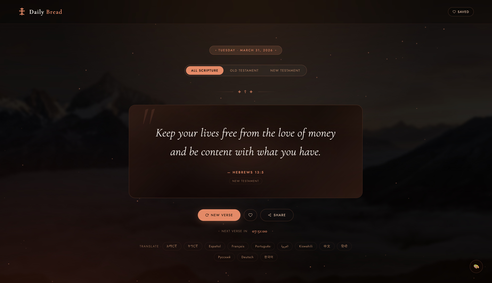

# ☦️ Daily Bread — Scripture for the Soul

A modern, full-stack Bible verse website built with vanilla HTML/CSS/JS 
and hosted entirely on AWS.

## 🌐 Live Site
[Visit Daily Bread →](https://michael-cloud-lab.click/)

## ✨ Features
- 📖 221 Bible verses across the full Old & New Testament
- 🗓️ Unique verse every day based on date
- 🔄 Random verse generator
- 💛 Save favorite verses (persisted via localStorage)
- 📋 Share verses to clipboard
- ⏱️ Midnight countdown to next daily verse
- 📚 Old Testament / New Testament filter
- 🌍 Multi-language translation (12 languages via AWS Lambda)
- 🌙 Warm & Night theme toggle
- ✦ Animated gold particles background
- 📱 Fully responsive on mobile
- ☦️ Orthodox cross branding

## 🏗️ Architecture

\`\`\`
Browser → CloudFront CDN → S3 (Static Site)
Browser → API Gateway → Lambda → Anthropic API (Translation)
\`\`\`

## ☁️ AWS Services Used
| Service | Purpose |
|---|---|
| S3 | Static website hosting |
| CloudFront | Global CDN + HTTPS |
| Route 53 | Custom domain DNS |
| ACM | Free SSL certificate |
| API Gateway | REST endpoint for translations |
| Lambda | Serverless translation microservice |
| IAM | Least-privilege security roles |

## 🚀 Deployment

### Frontend (S3 + CloudFront)
1. Upload `src/index.html` to S3 bucket
2. Enable static website hosting on S3
3. Create CloudFront distribution pointing to S3
4. Request ACM certificate in us-east-1
5. Add CNAME records in Route 53
6. Point A records to CloudFront distribution

### Translation API (Lambda)
1. Create Lambda function (Node.js 20.x)
2. Deploy `lambda/translate.mjs`
3. Add `ANTHROPIC_API_KEY` environment variable
4. Create API Gateway REST trigger
5. Enable CORS and deploy to prod stage
6. Update `LAMBDA_URL` in `src/index.html`

## 🛠️ Built With
- Vanilla HTML, CSS, JavaScript
- AWS (S3, CloudFront, Route 53, ACM, Lambda, API Gateway)
- Cormorant Garamond + Jost (Google Fonts)
- Anthropic Claude API (translations)

## 👤 Author
**Michael Belay**  
IT System Administrator | Cloud Enthusiast  
[LinkedIn](https://www.linkedin.com/in/michael-belay-149093221/) · 
[GitHub](https://github.com/michaelbelay-dev)
